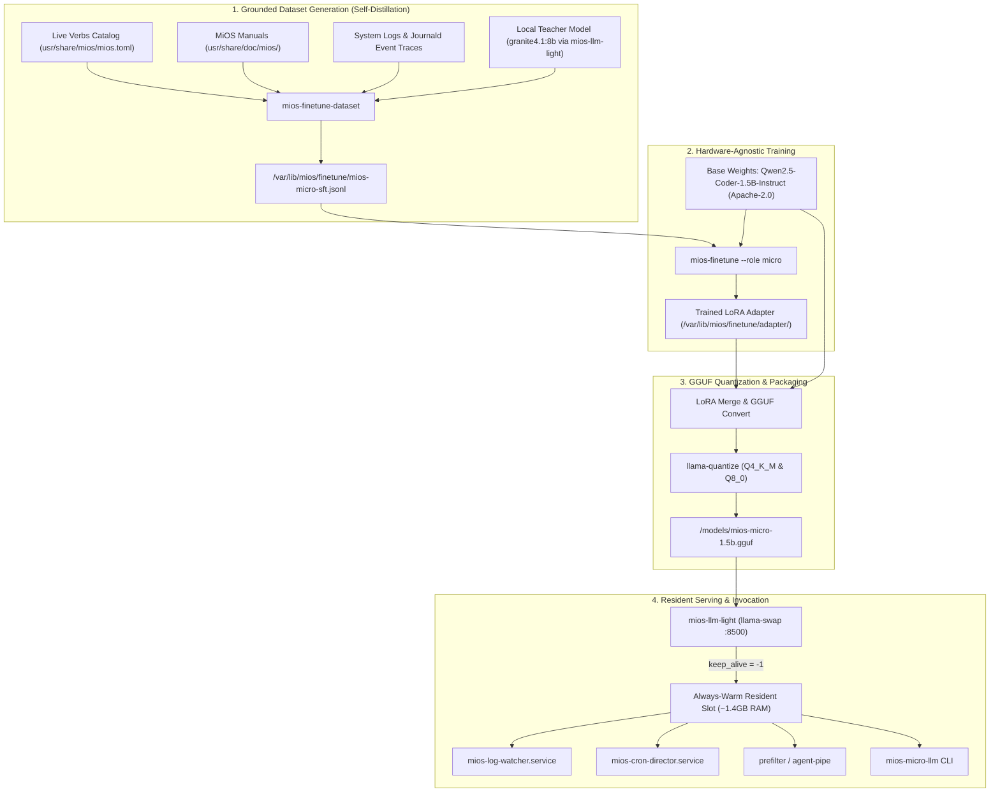

# Technology Evaluation & Architecture: MiOS-Micro Training Pipeline

**Document ID:** TECH-EVAL-MIOS-MICRO-2026-09  
**Evaluation Topic:** Dedicated MiOS-Native Miniature Model (`MiOS-Micro`, ~1.5B Parameters / >4Gb Footprint) Architecture, Training, and Inference Substrate  
**Author:** Antigravity AIOS Architecture & Modeling Task Force  
**Date:** 2026-09-21  
**Status:** PROPOSED (Target for Implementation)  

---

## 1. Problem Statement & Operational Constraints

### 1.1 Context & Motivation
MiOS operates as a dual-personality system: an immutable Fedora bootc/OCI workstation and a self-developing local agentic AIOS. To maintain responsiveness, the operating system relies on low-latency (<250ms) inference for background system daemons:
- **`mios-log-watcher.service`**: Real-time classification and triage of `journald` system events.
- **`mios-cron-director.service`**: Dynamic gating of cron and maintenance jobs based on host pressure and battery states.
- **`prefilter` / `agent-pipe`**: Rapid decomposition and routing of operator natural language inputs to the verb catalog.
- **`mios-micro-llm`**: Local CLI classification and single-line tool-calling.

### 1.2 Current State & Critical Bottlenecks
Currently, the system micro-lane uses `Liquid AI LFM2-700M` (`lfm2:700m`) aliased to `qwen3:1.7b` on `mios-llm-light`. While fast on CPU (~0.7GB resident), it carries a **severe architectural limitation**:
> *"CAVEAT: LFM2 tool-calls use a Pythonic special-token format, not OpenAI JSON -- fine for the short micro job, not a JSON-tool agent."* (`usr/share/mios/llamacpp/mios-llm-light.yaml:18`)

This directly violates **Architectural Law 2 / Law 5 (Strict OpenAI API standards and patterns ONLY)**. Without native OpenAI JSON tool-calling, background daemons must either parse unstructured text via fragile regexes or defer to the heavy brain (`granite4.1:8b` or `mios-heavy`), introducing 2–5s latency spikes.

### 1.3 Target Specifications & Hard Constraints
- **Target Size**: Miniature footprint (`>4Gb` model size in bits, i.e. 1.0B to 2.5B dense parameters; ~1.0GB to 2.0GB in quantized GGUF; ~3GB to 4GB in uncompressed FP16).
- **Resident Footprint**: $\le 1.8\text{ GB}$ VRAM / RAM at runtime with `keep_alive = -1` (never unload).
- **License**: Strictly **Apache-2.0 or MIT** (OSI/FSF approved permissive open-source license). Non-negotiable per user directive.
- **Inference Runtime**: Standard, unpatched mainline `llama.cpp` / `llama-server` behind `ghcr.io/mostlygeek/llama-swap` proxy.
- **Wire Contract**: Native OpenAI `/v1/chat/completions` with JSON schema structured outputs and function calling (`tool_calls`).

---

## 2. Base Model Candidate Evaluation

We evaluated leading open-weight miniature base models ($<3\text{B}$ parameters) against MiOS architectural constraints:

| Candidate | Architecture | License | Parameter Count | GGUF Q4_K_M | GGUF Q8_0 | Context Window | Native Tool Calling / OpenAI JSON |
| :--- | :--- | :---: | :---: | :---: | :---: | :---: | :---: |
| **Qwen2.5-Coder-1.5B-Instruct** | Dense Transformer (GQA, RoPE) | **Apache-2.0** | 1.54B | **0.99 GB** | **1.65 GB** | 32,768 | **Native (State-of-the-Art)** |
| **SmolLM2-1.7B-Instruct** | Dense Transformer | **Apache-2.0** | 1.71B | 1.10 GB | 1.80 GB | 8,192 | Good (Standard Jinja) |
| **Granite-3.1-2B-Instruct** | Dense Transformer | **Apache-2.0** | 2.50B | 1.60 GB | 2.70 GB | 131,072 | Native (Enterprise Tooling) |
| **Qwen2.5-Coder-3B-Instruct** | Dense Transformer | *Qwen Research* (Non-FOSS) | 3.09B | 1.85 GB | 3.10 GB | 32,768 | Native (Disqualified on License) |
| **Llama-3.2-1B / 3B** | Dense Transformer | *Llama 3.2 Community* | 1.23B / 3.21B | 0.85 GB / 1.95 GB | 1.35 GB / 3.30 GB | 131,072 | Moderate (Custom Special Tokens) |
| **Liquid AI LFM2-700M** | Recurrent Conv Hybrid | Custom Open | 0.70B | 0.45 GB | 0.75 GB | 32,768 | **None (Pythonic tokens only)** |

### Candidate Assessment:
1. **`Qwen2.5-Coder-1.5B-Instruct` (Recommended Primary)**:
   - **Full Apache-2.0 License**: Unlike the 3B variant (which uses the non-OSI Qwen Research license), the 1.5B variant is 100% Apache-2.0.
   - **Mainline Support**: Standard dense architecture loads cleanly on stock `llama-server` without the custom RoPE traps that broke Qwen3.5.
   - **Exceptional Coding & Schema Following**: Highest HumanEval, MultiPL-E, and JSON schema compliance in the sub-2B category.
   - **Memory**: 0.99 GB in Q4_K_M; leaves massive headroom on any 4GB or 8GB hardware node.
2. **`IBM Granite-3.1-2B-Instruct` (Alternative)**:
   - Strong enterprise tool calling, shares architectural lineage with `granite4.1:8b` (MiOS light brain). Slightly larger (1.6GB Q4).

---

## 3. Training & Distillation Framework Evaluation

We evaluated open-source training frameworks for local and automated SFT/DPO training:

| Framework | License | Hardware Backends | VRAM Efficiency | GGUF Export Path | Verdict |
| :--- | :---: | :--- | :--- | :--- | :--- |
| **Hugging Face TRL + PEFT** | Apache-2.0 | CUDA, ROCm, MPS, CPU | High (QLoRA 4-bit NF4) | `convert_lora_to_gguf.py` / `llama.cpp` | **Winner (Native Integration)** |
| **torchtune** | BSD-3 | CUDA, ROCm, MPS, CPU | High (Zero dependency) | Manual PyTorch state dict | High potential; requires custom export |
| **Unsloth** | Apache-2.0 | CUDA only | Exceptional (70% less VRAM) | Direct `model.save_pretrained_gguf` | Supported as CUDA fast-path |
| **Axolotl** | Apache-2.0 | CUDA, ROCm | Medium (Heavy CLI abstraction) | Post-process script | Disqualified (Overly complex) |

**Decision:** Leverage the unified **TRL + PEFT `SFTTrainer`** core already scaffolded in [`usr/libexec/mios/mios-finetune`](file:///workspaces/MiOS/usr/libexec/mios/mios-finetune), backed by **Unsloth** on CUDA hosts and pure PyTorch on CPU/ROCm/Apple Silicon.

---

## 4. MiOS-Micro Architecture & Training Pipeline



### 4.1 Dataset Composition (The Four MiOS Pillars)
1. **Pillar 1: System Command & CLI Synthesis (35%)**:
   - Instruction: Natural language intent -> Exact command execution.
   - Ground truth: `miosd` verbs, `bootc upgrade|switch|status`, `greenboot`, `podman run|ps|logs`, `systemctl`, `journalctl`.
2. **Pillar 2: Journal Log Event Triage (25%)**:
   - Input: Raw log line from `/var/log/messages` or `journald`.
   - Output: Structured JSON:
     ```json
     {
       "severity": "WARN",
       "subsystem": "bootc",
       "root_cause": "composefs digest verification mismatch",
       "actionable": true,
       "recommended_action": "bootc rollback"
     }
     ```
3. **Pillar 3: Fast Intent & Capability Routing (25%)**:
   - Maps user requests to the 60+ verbs in `[verbs]` without full orchestrator overhead.
4. **Pillar 4: Strict Function Calling & Schema Conformance (15%)**:
   - Two-sided positive/negative tool calling syntax adhering 100% to OpenAI specification.

---

## 5. Deployment & SSOT Integration Specification

### 5.1 `usr/share/mios/mios.toml` Declarations
Configure the dedicated `[finetune.micro]` table:

```toml
[finetune.micro]
enable           = true
target_role      = "micro"
base_model       = "qwen2.5-coder:1.5b"
hf_base          = "Qwen/Qwen2.5-Coder-1.5B-Instruct"
output_tag       = "mios-micro:1.5b"
device           = "auto"
load_in_4bit     = "auto"
lora_r           = 16
lora_alpha       = 32
epochs           = 3
learning_rate    = 3.0e-4
batch_size       = 4
grad_accum       = 4
max_seq_len      = 4096
dataset_path     = "/var/lib/mios/finetune/mios-micro-sft.jsonl"
```

### 5.2 Model Map (`usr/share/mios/llamacpp/mios-llm-light.yaml`)
Register `mios-micro:1.5b` with resident slot management:

```yaml
  "mios-micro:1.5b":
    aliases:
      - mios-micro
      - micro
    cmd: >
      /app/llama-server --model /models/mios-micro-1.5b-q4_k_m.gguf
      --port ${PORT} --host 127.0.0.1
      --ctx-size 8192 --parallel 1 --cache-reuse 256
      --n-gpu-layers 999 --flash-attn on
      --cache-type-k q8_0 --cache-type-v q8_0
      --slot-save-path /var/lib/mios/llamacpp/slots --jinja
    proxy: "http://127.0.0.1:${PORT}"
    ttl: -1  # Always resident
```

---

## 6. Implementation Roadmap & Verification Plan

1. **Step 1: Dataset Generation Protocol (`usr/libexec/mios/mios-finetune-dataset`)**:
   - Add `--role micro` flag generating the 4-pillar SFT dataset from the live system surface.
2. **Step 2: Training Pipeline Execution (`usr/libexec/mios/mios-finetune`)**:
   - Run dry-run validation against `Qwen/Qwen2.5-Coder-1.5B-Instruct`.
   - Verify GGUF export via `llama.cpp` quantization tools.
3. **Step 3: Mainline llama-swap Integration**:
   - Update `mios-llm-light.yaml` to serve `mios-micro:1.5b` with `--jinja` enabled for native OpenAI JSON tool calling.
4. **Step 4: Client Verification**:
   - Update `usr/libexec/mios/mios-micro-llm` to resolve `mios-micro:1.5b` as default.
   - Run two-sided controls:
     - Positive control: structured JSON log classification resolves in <250ms.
     - Negative control: invalid tool call schema fails with explicit schema mismatch.
